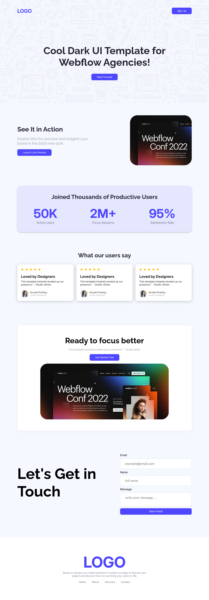

<h2>Created Landing page using HTML and CSS. Completed main requirements and challenges part.</h2>

1. Navbar Section

2. Banner Section

3. Action Section

4. Productive Users Section

5. Let’s Get In Touch Section

6. Footer Section

<h3>Challenges Part</h3>

7. Users’ Feedback Section

8. Button Animation - in Banner section button

